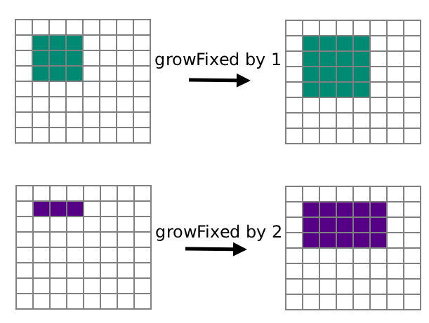

Check out the Rectangle class in the Java API:
  - [Java Rectangle class API](https://docs.oracle.com/javase/7/docs/api/index.html?java/awt/Rectangle.html)


You will create ONE class with:
  - 6 methods that work with Rectangles
  - 2 methods that work with Points
  - public static void main() app that contains code for the following 5 exercises.

## jumpRight(Rectangle rec)


Looks at Rectangle rec and returns a new Rectangle that is located
rec's width to the right of rec.

@param rec The original Rectangle to be referenced.

@return A new Rectangle object shifted to the right.

        Preconditions: rec is a rectangle object that is not null. rec has a
        width greater than 0.
        Postconditions: rec has not been changed. The method returns a new
        Rectangle
        object with the same y-location but with an x-location that equals
        rec's x
        plus rec's width.

## jumpDown(Rectangle rec)


Looks at Rectangle rec and returns a new Rectangle that is located
rec's height below rec.

@param rec The original Rectangle to be referenced.

@return A new Rectangle object shifted downward.

        Preconditions: rec is a rectangle object that is not null. rec has a
        height greater than 0.
        Postconditions: rec has not been changed. The method returns a new
        Rectangle
        object with the same x-location but with a y-location that equals
        rec's y
        plus rec's height.

## jumpLeft(Rectangle rec)

Looks at Rectangle rec and returns a new Rectangle that is located
rec's width to the left of rec.

@param rec The original Rectangle to be referenced.

@return A new Rectangle object shifted to the left.

        Preconditions: rec is a rectangle object that is not null. rec has a
        width greater than 0.
        Postconditions: rec has not been changed. The method returns a new
        Rectangle
        object with the same y-location but with an x-location that equals
        rec's x
        minus rec's width.

## jumpUp(Rectangle rec)

Looks at Rectangle rec and returns a new Rectangle that is located
rec's height above rec.

@param rec The original Rectangle to be referenced.

@return A new Rectangle object shifted upward.

        Preconditions: rec is a rectangle object that is not null. rec has a
        height greater than 0.
        Postconditions: rec has not been changed. The method returns a new
        Rectangle
        object with the same x-location but with a y-location that equals
        rec's y
        minus rec's height.

## doubleSize(Rectangle rec)


Looks at Rectangle rec and returns a new Rectangle that has twice
the width and twice the height of rec.

@param rec The original Rectangle to be referenced.

@return A new Rectangle object with doubled dimensions.

        Preconditions: rec is a rectangle object that is not null.
        Postconditions: rec has not been changed. The method returns a new
        Rectangle
        object with the same x and y coordinates, but with a width equal to
        rec's width * 2 and a height equal to rec's height * 2.

## growFixed(Rectangle rec, int amount)



Looks at Rectangle rec and returns a new Rectangle that is at the
same x and y location, but with dimensions increased by the specified amount.

@param rec    The original Rectangle to be referenced.

@param amount The integer amount to be added to both width and height.

@return A new Rectangle object with increased dimensions.

        Preconditions: rec is a rectangle object that is not null.
        amount is a non-negative integer.
        Postconditions: rec has not been changed. The method returns a new
        Rectangle
        object with the same (x, y) coordinates, but with a
        width equal to (rec.width + amount) and a
        height equal to (rec.height + amount).


## isTouching(Point p1, Point p2, double minimumDistance)

Determines if two points are close enough to be considered "touching"
based on a specified threshold.

@param p1              The first Point object.

@param p2              The second Point object.

@param minimumDistance The maximum distance allowed for the points to be
                       "touching."

@return true if the distance between p1 and p2 is less than or equal to
        minimumDistance; false otherwise.

        Preconditions: p1 and p2 are not null. minimumDistance is
        non-negative.
        Postconditions: p1 and p2 have not been changed.


## findMidpoint(Point p1, Point p2)

Calculates the coordinates halfway between two points and returns
a new Point2D.Double object at the average x, average y location.
NOTE: use Point2D.Double middle = new Point2D.Double(x, y);

@param p1 The first Point object.

@param p2 The second Point object.

@return A new Point2D.Double object located exactly between p1 and p2.

        Preconditions: p1 and p2 are not null.
        Postconditions: p1 and p2 have not been changed. The method returns
        a new Point with x at p1.x + p2.x / 2 and y at p1.y + p2.y / 2.
        For example, the midpoint of (3,3) and (4,4) is (3.5, 3.5)


# Write the following app in public static void main

## App Part 1 of 5

Write a program that:
  1.  Constructs a Rectangle object.
  1.  Prompt the user for a width and height.
  1.  Use the setSize method to adjust the width and height of your Rectangle object.
  1.  Use the Rectangle library's grow method to grow the width by 10 and grow the height by 10. For example... boxOne.grow(10,10); 
  1.  Print the new width using the getWidth method.
  1.  Print the new height using the getHeight method.
  1.  Finally, compute and print its new area using the getWidth and getHeight methods.

Sample Output
```
Part 1 of 5 -=-=-=-=-=-=-=-=-=-=-=-=-=-=-=-=-=-=-=-=-=-=-=-=-=-
Please enter the width and height of the rectangle as whole numbers
Width: 5
Height: 6
After growing the width by 10 and the height by 10...
New width is 25.0
New height is 26.0
New area is 650.0
```

## App Part 2 of 5

Look into the API documentation of the Rectangle class and locate the method
```
boolean contains(int x, int y)
```

Directions:
- Construct a new Rectangle named mysteryBox at any x,y location (your choice!) with a width of 20 and a height of 30.
- Prompt the user for an x location
- Prompt the user for a y location
- Print mysteryBox.contains(x,y)
- Finally, print mysteryBox to reveal the x, y, width, and height
    
Sample Output  (your mysteryBox should be at a different location)
```
Part 2 of 5
Please type x location: 15
Please type y location: 17
true
java.awt.Rectangle[x=9,y=10,width=20,height=30]
```

## App Part 3 of 5

Double the height and width.

Construct a Rectangle object named doubleSquare representing a square with top-left corner (100, 100) and side length 50, then print its location by calling System.out.println(doubleSquare). Use the translate and grow methods to make the square twice the size and move it to location (300,400). Finally, call System.out.println(doubleSquare) again.

This code will not produce a drawing. It will simply print the locations of square before and after calling the mutator methods. Look up the description of the grow method in the API documentation.

## App Part 4 of 5

Halve the width only.

Construct a Rectangle object named halfWidthSquare representing a square with top-left corner (55, 55) and side length 600, then print its location by calling System.out.println(halfWidthSquare). Use the translate and grow methods to make the square half the width and move it to location (55,0). Finally, call System.out.println(halfWidthSquare) again.

This code will not produce a drawing. It will simply print the locations of square before and after calling the mutator methods. Look up the description of the grow method in the API documentation.

**NOTE**: In computer science, the y-axis is inverted and 0,0 is in the top-left corner of the screen.


## App Part 5 of 5

[Java Point class API](https://docs.oracle.com/javase/7/docs/api/java/awt/Point.html)

Look at the API of the Point class and find out how to construct a Point object. In a PointTester program, construct two points with coordinates (3, 4) and (–3, –4). Find the distance between them, using the distance method (which is available because it is *inherited* from a different class). Print your prediction and then the calculated distance.