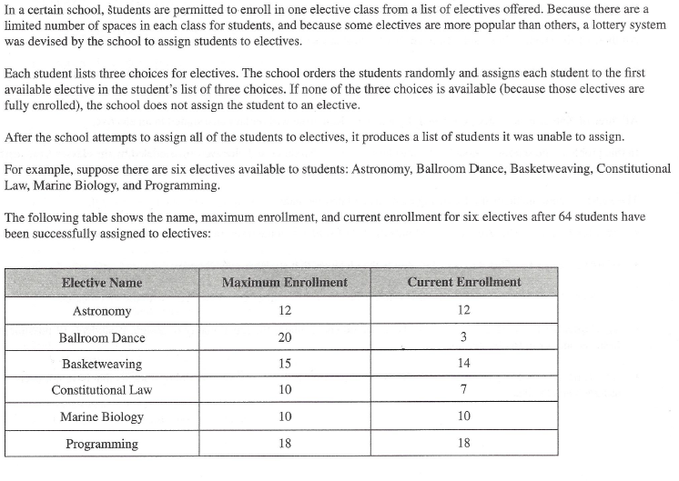
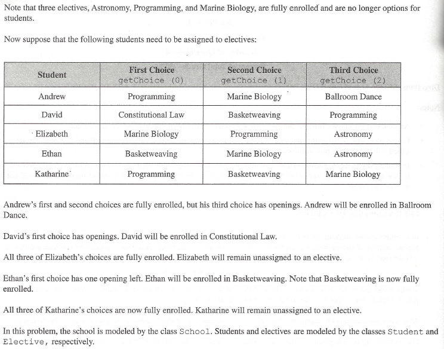
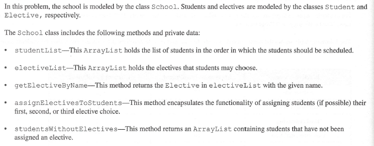
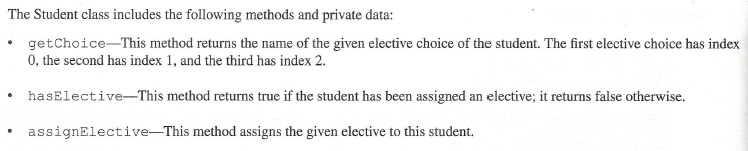
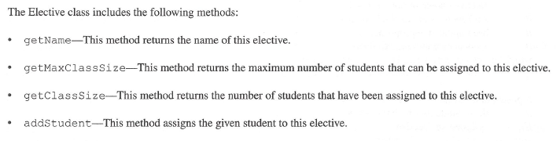
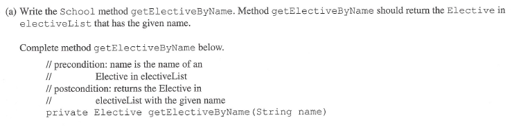
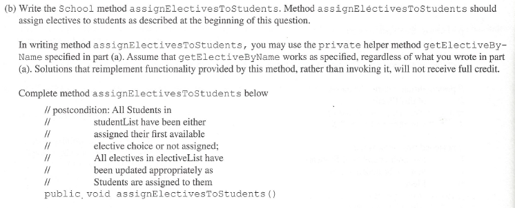
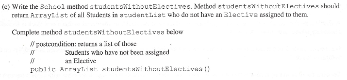

# FRQ Arrays/ArrayLists

In a certain school, students are permitted to enroll in one elective class from a list of electives offered. Because there are a limited number of spaces in each class for students, and because some electives are more popular than others, a lottery system was devised by the school to assign students to electives. 

Each student lists three choices for electives. The school orders the students randomly and assigns each student to the first available elective in the student’s list of three choices. If none of the three choices is available (because those electives are fully enrolled), the school does not assign the student to an elective.

After the school attempts to assign all of the students to electives, it produces a list of students it was unable to assign. 

For example, suppose there are six electives available to students: Astronomy, Ballroom Dance, Basketweaving, Constitutional Law, Marine Biology, and Programming.

The following table shows the name, maximum enrollment, and current enrollment for six electives after 64 students have
been successfully assigned to electives:
|Elective Name|Maximum Enrollment|Current Enrollment|
|---|---|---|
|Astronomy|12|12|
|Ballroom Dance|20|3|
|Basketweaving|15|14|
|Constitutional Law | 10|7 |
|Marine Biology |10 |10 |
|Programming |30 |30 |

Note that three elctives, Astronomy, Programming, and Marine Biology, are fully enrolled and are no longer options for students.

Now suppose that the following students need to be assigned to electives:
|Student|First Choice getChoice(0)|Second Choice getChoice(1)|Third Choice getChoice(2)|
|---|---|---|---|
|Andrew |Programming |Marine Biology |Ballroom Dance|
|David |Constitutional Law |Basketweaving |Programming|
|Elizabeth |Marine Biology |Programming |Astronomy|
|Ethan |Basketweaving |Marine Biology |Astronomy|
|Katharine |Programming |Basketweaving |Marine Biology|

Andrew’s first and second choices are fully enrolled, but his third choice has openings. Andrew will be enrolled in Ballroom Dance.

David’s first choice has openings. David will be enrolled in Constitutional Law.

All three of Elizabeth’s choices are fully enrolled. Elizabeth will remain unassigned to an elective.

Ethan’s first choice has one opening left. Ethan will be enrolled in Basketweaving. Note that Basketweaving is now fully enrolled.

All three of Katharine’s choices are now fully enrolled. Katharine will remain unassigned to an elective.

In this problem, the school is modeled by the class School. Students and electives are modeled by the classes Student and Elective respectively.

The School class includes the following methods and private data:
- studentList—This ArrayList holds the list of students in the order in which the students should be scheduled.
- electiveList—This ArrayList holds the electives that students may choose.
- getElectiveByName—This method returns the Elective in electiveList with the given name.
- assignElectivesToStudents—This method encapsulates the functionality of assigning students (if possible) their
first, second, or third elective choice.
- studentsWithoutElectives—This method returns an ArrayList containing students that have not been assigned an elective.

*[An outline of the School class is provided. See file School.java]*

The Student class includes the following methods and private data:
- getChoice—This method returns the name of the given elective choice of the student. The first elective choice has
index 0, the second has index 1, and the third has index 2.
- hasElective—This method returns true if the student has been assigned an elective; it returns false otherwise.
- assignElective—This method assigns the given elective to this student.

*[An outline of the Student class is provided. See file Student.java]*

The Elective class includes the following methods:
- getName—This method returns the name of this elective.
- getMaxClassSize—This method returns the maximum number of students that can be assigned to this elective.
- getClassSize—This method returns the number of students that have been assigned to this elective.
- addStudent—This method assigns the given student to this elective.

*[An outline of the Elective class is provided. See file Elective.java]*

(a) Write the School method getElectiveByName. Method getElectiveByName should return the Elective in electiveList that has the given name.

(b) Write the School method assignElectivesToStudents. Method assignElectivesToStudents should assign electives to students as described at the beginning of this question.

In writing method assignElectivesToStudents you may use the private helper method getElectiveByName specified in part (a). Assume that getElectiveByName works as specified, regardless of what you wrote in part (a). Solutions that reimplement functionality provided by this method, rather than invoking it, will not receive full credit.

(c) Write the School method studentsWithoutElectives. Method studentsWithoutElectives should return ArrayList of all Students in studentList who do not have an Elective assigned to them.

---

---

  