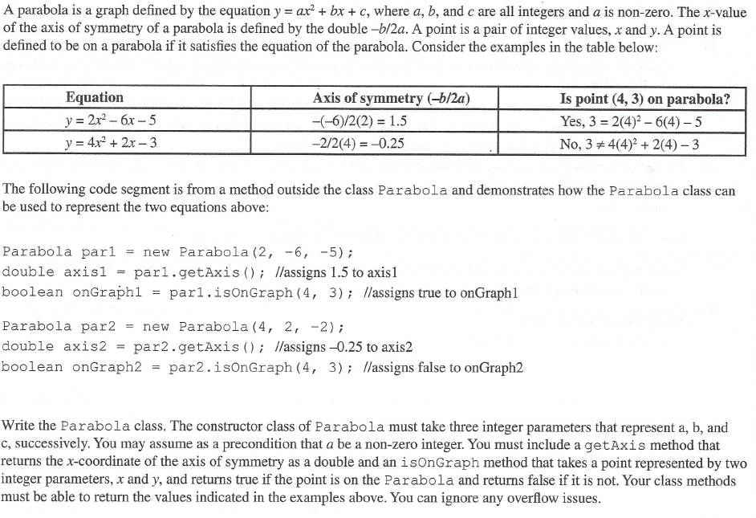

# FRQ #2 Parabola
A parabola is a graph defined by the equation 𝑦 = 𝑎𝑥<sup>2</sup> + 𝑏𝑥 + 𝑐, where 𝑎, 𝑏, and 𝑐 are all integers and 𝑎 is non-zero. The 𝑥-value
of the axis of symmetry of a parabola is defined by the double -𝑏 / 2𝑎. A point is a pair of integer values, 𝑥 and 𝑦. A point is defined to be on a parabola if it satisfies the equation of the parabola. Consider the examples in the table below:

| Equation          | Axis of symmetry (-𝑏/2𝑎) | Is point (4, 3) on parabola? |
| --------          | ------- | ------- |
| 𝑦 = 2𝑥<sup>2</sup> - 6𝑥 - 5      | -(-6) / 2(2) = 1.5    | Yes, 3 = 2(4)<sup>2</sup> - 6(4) - 5    |
| 𝑦 = 4𝑥<sup>2</sup> + 2𝑥 - 3  | -2 / 2(4) = -0.25    | No, 3 &ne; 4(4)<sup>2</sup> + 2(4) - 3    |

The following code segment is from a method outside the class Parabola and demonstrates how the Parabola class can be used to represent the two equations above:
```
Parabola par1 = new Parabola(2, -6, -5);
double axis = par1.getAxis() ; //assigns 1.5 to axis1
boolean onGraph1 = par1.isOnGraph(4, 3) ; //assigns true to on Graph1

Parabola par2 = new Parabola(4, 2, -2);
double axis2 = par2.getAxis() ; //assigns -0.25 to axis2
boolean onGraph2 = par2.isOnGraph(4, 3); //assigns false to onGraph2
```
Write the Parabola class. The constructor class of Parabola must take three integer parameters that represent 𝑎, 𝑏, and 𝑐, successively. You may assume as a precondition that a be a non-zero integer. You must include a getAxis method that returns the 𝑥-coordinate of the axis of symmetry as a double and an isOnGraph method that takes a point represented by two integer parameters, 𝑥 and 𝑦, and returns true if the point is on the Parabola and returns false if it is not. Your class methods must be able to return the values indicated in the examples above. You can ignore any overflow issues.


